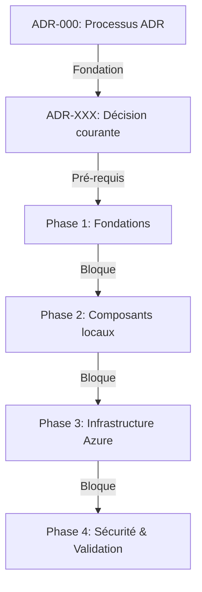

---
# 🤖 Machine-Readable Metadata (Frontmatter YAML)
# Permet parsing automatique par agents IA et recherche/filtrage avancé

# ⚠️ AVANT DE COMMENCER:
# 1. Lire ADR-000 (Processus) : ./000-META-processus-creation-adr.md
# 2. Consulter TAXONOMY.md pour classification complète
# 3. Vérifier README.md pour numérotation disponible dans votre plage
# 4. Ces 4 documents DOIVENT être cohérents - les consulter ensemble

adr: XXX  # Remplacer par numéro dans plage catégorie (voir 000-META)
title: "[Titre Descriptif de la Décision]"
status: "proposed"  # proposed|accepted|rejected|deprecated|remplacé
date: YYYY-MM-DD
superseded_by: null
replaces: null
related_adrs: []  # Numéros ADRs liés
related_issues: []  # Issues GitHub liées

# 🗂️ Taxonomie ADR (Voir TAXONOMY.md pour détails complets)
classification:
  # Lifecycle: État dans le cycle de vie
  lifecycle: "proposed"  # proposed|accepted|rejected|deprecated|remplacé
  
  # Domain: Domaine architectural principal (voir plages 000-META)
  # architecture|infrastructure|security|data|api|devops|test|business
  domain: "infrastructure"
  
  # Impact: Niveau d'impact sur le système
  impact: "medium"  # low|medium|high|critical
  
  # Quality Attributes (ASR): Qualités système affectées (ISO 25010)
  quality:
    - "reliability"       # availability, fault tolerance, recoverability
    - "security"          # confidentialité, isolation, chiffrement local
    - "compliance"        # Apache 2.0, RGPD, privacy-first
    # Autres: performance, maintainability, cost, usability, portability
  
  # Reversibility: Facilité de changement
  reversibility: "moderate"  # easy|moderate|hard|irreversible
  
  # Scope: Portée de la décision
  scope: "tactical"  # strategic|tactical|operational
  
  # Technology Area: Domaines technologiques concernés
  tech_areas:
    - "python"
    - "azure"
    # Autres: ollama, litellm, azure-relay, hybrid-connection,
    #         openai-api, https-proxy, api-gateway, authentication,
    #         caddy, nginx, vscode-byok, copilot, rest-api, bash

# Tags libres pour recherche flexible
tags: ["gateway", "security", "private-llm-gateway"]

# Stakeholders impliqués
stakeholders: ["@architecture-team", "@dev-team"]

# Effort estimé d'implémentation
effort: "medium"  # low|medium|high
---

# ADR XXX: [Titre Descriptif de la Décision]

<!-- PLACEHOLDER: Remplacer XXX par le prochain numéro séquentiel dans la plage de catégorie -->
<!-- PLACEHOLDER: Remplacer [Titre Descriptif] par un titre concis et actionable -->

## 📊 Vue d'Ensemble

| Attribut | Valeur |
|----------|--------|
| **Statut** | 🔄 Proposé |
| **Date Décision** | YYYY-MM-DD |
| **Stakeholders** | @architecture-team, @dev-team |
| **Impact** | 🔴 Élevé / 🟡 Moyen / 🟢 Faible |
| **Effort Implémentation** | 🔴 Élevé / 🟡 Moyen / 🟢 Faible |
| **Risque Technique** | 🔴 Élevé / 🟡 Moyen / 🟢 Faible |

<!-- PLACEHOLDER: Remplir le tableau ci-dessus avec les valeurs réelles -->

---

## 🎯 Contexte & Problème

<!-- PLACEHOLDER: Décrire le contexte et le problème ci-dessous -->
<!-- FORMAT: Paragraphes explicatifs + réponses aux questions guidées -->

### Questions Guidées

**1. Quel problème essayons-nous de résoudre?**
- [Décrire le problème principal dans le contexte Private LLM Gateway]
- [Impact actuel du problème sur l'exposition sécurisée, la compatibilité API ou l'intégration VS Code]

**2. Quelles sont les contraintes et exigences?**
- **Techniques**: [Ex: Compatibilité OpenAI API, Azure Relay, LiteLLM, Ollama local]
- **Sécurité & Authentification**: [Ex: HTTPS obligatoire, authentification API key, isolation réseau]
- **Performance**: [Ex: Latence acceptable, débit tokens/s, overhead proxy]
- **Portabilité**: [Ex: macOS local, Azure cloud, support multi-client]

**3. Quel est l'impact si nous ne prenons pas de décision?**
- **Court terme (0-3 mois)**: [Impact sur la sécurité / intégration client]
- **Moyen terme (3-12 mois)**: [Risque de faille sécurité ou limitation d'adoption]
- **Long terme (12+ mois)**: [Impact sur la maintenabilité et la scalabilité]

**4. Quels facteurs influencent cette décision?**
- **Architecture Gateway**: [Flux HTTPS -> Azure Proxy -> Relay -> Agent local -> LiteLLM -> Ollama]
- **Stack technique**: [Contraintes Python, Azure Relay, LiteLLM, Ollama, Caddy/Nginx]
- **Sécurité**: [Authentification, TLS, rate limiting, isolation réseau]
- **Opérationnalité**: [Scripts automation, configuration as code, monitoring]

---

## ✅ Décision

<!-- PLACEHOLDER: Décrire la décision prise ci-dessous -->
<!-- FORMAT: Approche + Justification + Principes appliqués -->

### Approche Choisie

[Décrire en détail la solution retenue]

**Exemple**:
> Nous adoptons **[solution choisie]** pour [objectif] afin de [bénéfice principal].
> Cette approche garantit [propriété clé] tout en respectant les principes de sécurité et privacy-first du Private LLM Gateway.

### Comment Cette Solution Résout le Problème

[Expliquer point par point comment la décision répond au problème]

1. **Problème X** → Résolu par [mécanisme Y]
2. **Exigence sécurité Z** → Satisfaite via [approche W]
3. **Contrainte performance** → Adressée par [solution optimisée]

### Principes Architecturaux Appliqués

- ✅ **Sécurité par défaut**: [HTTPS obligatoire, authentification, isolation réseau]
- ✅ **Privacy préservée**: [Modèles locaux, pas de fuite de données vers le cloud]
- ✅ **Compatibilité OpenAI**: [API standard pour intégration facile]
- ✅ **Modularité**: [Composants découplés via interfaces réseau]
- ✅ **[Autre principe]**: [Description]

### Technologies/Outils Utilisées

| Technologie | Version | Rôle | Justification |
|-------------|---------|------|---------------|
| Python | ≥ 3.9 | Relay agent | Simplicité, Azure SDK support |
| Ollama | Latest stable | Runtime LLM local | Multi-modèle, performance |
| LiteLLM | Latest stable | Gateway OpenAI | Compatibilité API standard |
| Azure Relay | N/A | Connectivité privée | Bridge sécurisé vers local |
| Caddy/Nginx | Latest stable | Reverse proxy HTTPS | TLS, routing, auth |
| [Autre] | [Version] | [Rôle] | [Justification] |

---

## 📊 Matrice de Décision Quantifiée

<!-- PLACEHOLDER: Remplir le tableau ci-dessous avec les scores réels -->
<!-- FORMAT: Évaluation objective sur 10 pour chaque critère -->

| Critère | Poids | Alternative 1 | Alternative 2 | Décision Choisie | Notes |
|---------|-------|---------------|---------------|------------------|-------|
| **Sécurité HTTPS/TLS** | 30% | 🟡 Partiel (5/10) | 🟢 Complet (9/10) | 🟢 Complet (10/10) | Sécurité obligatoire |
| **Confidentialité données** | 25% | 🟡 Moyen (6/10) | 🟢 Élevé (8/10) | 🟢 Élevé (9/10) | Modèles restent locaux |
| **Performance/Latence** | 20% | 🟢 Bonne (8/10) | 🟡 Moyenne (5/10) | 🟢 Bonne (8/10) | Latence acceptable |
| **Maintenabilité** | 15% | 🟡 Moyen (6/10) | 🟢 Élevé (8/10) | 🟢 Élevé (9/10) | Code Python modulaire |
| **Compatibilité OpenAI** | 10% | 🟢 Bonne (8/10) | 🔴 Limitée (4/10) | 🟡 Moyenne (7/10) | API standard |
| **Score Total Pondéré** | 100% | **6.30** | **7.45** | **9.05** ⭐ | Winner |

### Calcul Détaillé (Pour Validation IA)

```
Alternative 1: (5*0.30) + (6*0.25) + (8*0.20) + (6*0.15) + (8*0.10) = 6.30
Alternative 2: (9*0.30) + (8*0.25) + (5*0.20) + (8*0.15) + (4*0.10) = 7.45
Décision:      (10*0.30) + (9*0.25) + (8*0.20) + (9*0.15) + (7*0.10) = 9.05 ✅
```

---

## ⚖️ Conséquences

### ✅ Positives (Bénéfices)

| Bénéfice | Métrique Cible | Valeur Attendue | Mesure |
|----------|----------------|-----------------|--------|
| Sécurité HTTPS/TLS | Chiffrement bout-en-bout | ✅ Vérifié | Audit sécurité |
| Confidentialité données | Modèles locaux uniquement | 100% local | Test isolation |
| Performance Gateway | Latence API | < 200ms | Benchmark requêtes |
| Facilité déploiement | Temps setup | < 30 minutes | Test utilisateur |

### ⚠️ Négatives (Risques & Limitations)

| Risque | Impact | Probabilité | Mitigation | Responsable | Deadline |
|--------|--------|-------------|------------|-------------|----------|
| Changement API OpenAI | 🟡 Moyen | 🟡 Moyen | Versioning API, tests compatibilité | @dev-team | Continu |
| Dégradation performance réseau | 🟡 Moyen | 🟢 Faible | Monitoring latence, retry logic | @dev-team | Mensuel |
| Dépendances Azure SDK | 🟡 Moyen | 🟡 Moyen | Version pinning, tests régression | @dev-team | Continu |

---

## 🔄 Alternatives Considérées

### Alternative 1: [Nom Descriptif]

**Description**:
[Brève description de l'alternative avec détails techniques]

**Avantages**:
- ✅ [Avantage 1]
- ✅ [Avantage 2]

**Inconvénients**:
- ❌ [Inconvénient 1]
- ❌ [Inconvénient 2]

**Rejetée parce que**:
[Raisons principales du rejet, référence à la matrice de décision]

**Score Matrice**: 6.30/10

---

### Alternative 2: [Nom Descriptif]

**Description**:
[Brève description]

**Avantages**:
- ✅ [Avantage 1]

**Inconvénients**:
- ❌ [Inconvénient 1]

**Rejetée parce que**:
[Raisons]

**Score Matrice**: 7.45/10

---

## 🚀 Plan d'Implémentation

### Phases & Deliverables

| Phase | Durée Estimée | Deliverables | Blockers Potentiels | Critères de Validation | Responsable |
|-------|---------------|--------------|---------------------|------------------------|-------------|
| **Phase 1: Fondations** | 1 semaine | - Configuration initiale<br>- Scripts de base<br>- Tests unitaires | - Environnement Python configuré<br>- Approbation architecture | - CI vert<br>- Code review approuvé | @dev-team |
| **Phase 2: Composants locaux** | 2 semaines | - Ollama opérationnel<br>- LiteLLM configuré<br>- Agent local fonctionnel | - Environnement de base validé | - Ollama répond localement<br>- LiteLLM route correctement | @dev-team |
| **Phase 3: Infrastructure Azure** | 2 semaines | - Azure Relay configuré<br>- Proxy HTTPS déployé<br>- DNS configuré | - Toutes phases précédentes OK | - Connexion relay OK<br>- Endpoint public accessible | @dev-team |
| **Phase 4: Sécurité & Validation** | 1 semaine | - Authentification implémentée<br>- TLS vérifié<br>- Tests intégration | - Phase 3 validée | - Tests sécurité OK<br>- Documentation complète | @architecture-team |

### Dépendances & Ordre d'Exécution



---

## 🎯 Critères de Succès & Validation

### Métriques de Succès (Post-Implémentation)

| Métrique | Valeur Cible | Valeur Baseline | Statut Actuel | Date Mesure |
|----------|--------------|-----------------|---------------|-------------|
| **Sécurité HTTPS/TLS** | Grade A+ SSL Labs | N/A | ⏳ À mesurer | - |
| **Latence Gateway** | < 200ms overhead | N/A | ⏳ À mesurer | - |
| **Latence inference LLM** | < 5s (1ère token) | N/A | ⏳ À mesurer | - |
| **Temps déploiement** | < 30 min | N/A | ⏳ À mesurer | - |

### Critères de Re-évaluation

**Déclencher une review complète si**:
- ⚠️ Nouvelle version majeure OpenAI API avec breaking changes
- ⚠️ Changement dans Azure Relay pricing ou limitations
- ⚠️ Faille de sécurité critique détectée

**Responsable Review**: @architecture-team  
**Fréquence Review Planifiée**: Tous les 6 mois

---

## 🔗 Traçabilité & Liens

### Issues GitHub Liées

| Issue | Type | Relation | Description |
|-------|------|----------|-------------|
| [#XX](link) | Feature | **Origine** | [Description de l'issue qui a motivé cet ADR] |

### ADRs Connexes

| ADR | Titre | Relation | Impact |
|-----|-------|----------|--------|
| [ADR-000](000-META-processus-creation-adr.md) | Processus ADR | **Processus** | Gouvernance ADR |

### Documentation Externe

- [Private LLM Gateway GitHub](https://github.com/michel-heon/private-llm-gateway)
- [Ollama Documentation](https://ollama.com/)
- [LiteLLM Documentation](https://docs.litellm.ai/)
- [Azure Relay Documentation](https://learn.microsoft.com/azure/azure-relay/)
- [ADR Best Practices](https://adr.github.io/)

---

## 📝 Notes & Historique

### Changelog

| Date | Auteur | Changement | Raison |
|------|--------|------------|--------|
| YYYY-MM-DD | @architect | Création initiale | Issue #XX |

---

## 🤖 Métadonnées IA (Machine-Only)

```json
{
  "adr_id": "XXX",
  "project": "Private LLM Gateway",
  "parsing_version": "2.0",
  "generated_at": "YYYY-MM-DDTHH:mm:ssZ",
  "validation_status": "valid",
  "dependency_graph": {
    "depends_on": [],
    "blocks": [],
    "related": []
  }
}
```

---

## 📋 Instructions d'Utilisation

### Pour Humains

1. **Copier ce template**: `cp adr-template-ai-optimized.md XXX-CATÉGORIE-titre-decision.md`
2. **Choisir la catégorie** et **numéro dans la plage** :
   - META (000-099), ARCH (100-199), INFRA (200-299), SEC (300-399)
   - DATA (400-499), API (500-599), DEVOPS (600-699), TEST (700-799), BIZ (800-899)
3. **Remplacer XXX** : Par le prochain numéro disponible dans la plage de votre catégorie
4. **Remplir frontmatter YAML** : Métadonnées + classification 7 dimensions
5. **Compléter placeholders** : Chercher `<!-- PLACEHOLDER:` et remplacer
6. **Remplir matrice décision** : Évaluer objectivement chaque critère sur 10
7. **Valider avec équipe** : Review par stakeholders listés
8. **Committer** : `git commit -m "docs(adr): ADR-XXX [CATÉGORIE] Titre"`
9. **Ajouter à l'index** : Mettre à jour `docs/adr/README.md`

**Exemples noms fichiers (contexte Private LLM Gateway)** :
```bash
000-META-processus-creation-adr.md              # Méta (000-099)
100-ARCH-architecture-ia-locale-modulaire.md    # Architecture (100-199)
200-INFRA-azure-relay-hybrid-connection.md      # Infrastructure (200-299)
300-SEC-confidentialite-donnees-locales.md      # Sécurité (300-399)
400-DATA-choix-vector-database-locale.md        # Données (400-499)
500-API-litellm-openai-compatibility.md         # API (500-599)
600-DEVOPS-ci-cd-automation.md                  # DevOps (600-699)
700-TEST-integration-validation.md              # Tests (700-799)
800-BIZ-licensing-open-source-apache.md         # Business (800-899)
```

---

## ✅ Checklist Complétude

### Minimum Requis (Obligatoire)
- [ ] Frontmatter YAML rempli (adr, title, status, date, classification)
- [ ] Section Contexte complète (≥ 200 mots)
- [ ] Section Décision complète (≥ 150 mots)
- [ ] Matrice décision avec ≥ 3 critères
- [ ] Conséquences positives ET négatives listées
- [ ] ≥ 2 alternatives considérées
- [ ] Plan implémentation avec phases
- [ ] Critères de succès définis

### Recommandé (Haute Valeur)
- [ ] Métriques quantifiées dans conséquences
- [ ] Stratégies mitigation pour risques élevés
- [ ] Dépendances ADRs/Issues explicites
- [ ] Références documentation Ollama / LiteLLM / Azure Relay pertinentes
- [ ] Conformité licence Apache 2.0 vérifiée

---

**Version Template**: 2.0 (AI-Optimized)  
**Dernière Mise à Jour**: 2026-06-04  
**Projet**: Private LLM Gateway  
**Compatibilité**: Agents IA (ChatGPT, Claude, Copilot) + Humains
