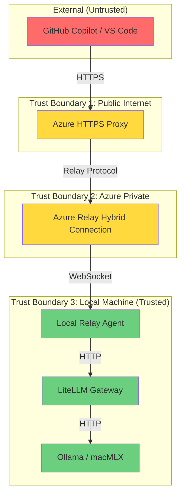

# RECIT-304 : Créer threat model diagram

**Type** : Récit Utilisateur  
**ID** : RECIT-304  
**Épopée** : [EPOP-003](../Épopées/EPOP-003-securite.md)  
**Statut** : 📋 To Do

---

## 📋 Description

**En tant que** security engineer  
**Je veux** un diagramme d'architecture avec attack surface  
**Afin de** identifier les vecteurs d'attaque potentiels

---

## ✅ Critères d'Acceptation

- [ ] Diagramme threat model (Mermaid ou draw.io)
- [ ] Trust boundaries identifiées
- [ ] STRIDE analysis pour chaque composant
- [ ] Mitigations documentées dans `docs/reference/security.md`

---

## 📊 Informations

**Priorité** : Should Have  
**Effort** : 5 points  
**Sprint** : Sprint 3  
**Assigné** : Riley

---

## 🔗 Dépendances

- 📄 [docs/architecture/overview.md](../../../architecture/overview.md) : Architecture système
- 📄 [docs/reference/security.md](../../../reference/security.md) : Security baseline

---

## 📝 Spécifications Techniques

### Diagramme Threat Model (Mermaid)

### STRIDE Analysis

#### Composant: Azure HTTPS Proxy

| Menace | Type STRIDE | Risque | Mitigation |
|--------|-------------|--------|------------|
| Attaque DDoS | Denial of Service | Élevé | Rate limiting (RECIT-303) |
| Injection prompts | Tampering | Moyen | Input validation |
| Logs exposés | Information Disclosure | Élevé | Log redaction (RECIT-302) |
| Credentials volés | Spoofing | Élevé | Azure Key Vault (RECIT-301) |

#### Composant: Azure Relay

| Menace | Type STRIDE | Risque | Mitigation |
|--------|-------------|--------|------------|
| Connection string leak | Information Disclosure | Élevé | Key Vault + Managed Identity |
| MitM attack | Spoofing/Tampering | Faible | TLS 1.3 forcé |
| Unauthorized access | Elevation of Privilege | Moyen | SAS tokens avec expiration |

#### Composant: Local Relay Agent

| Menace | Type STRIDE | Risque | Mitigation |
|--------|-------------|--------|------------|
| Agent compromise | Elevation of Privilege | Élevé | Principe du moindre privilège |
| Localhost bypass | Spoofing | Faible | LiteLLM écoute 127.0.0.1 only |
| Logs locaux | Information Disclosure | Moyen | Redaction + rotation logs |

#### Composant: Ollama/macMLX

| Menace | Type STRIDE | Risque | Mitigation |
|--------|-------------|--------|------------|
| Model poisoning | Tampering | Faible | Téléchargement depuis sources officielles |
| Prompt injection | Tampering | Moyen | Input sanitization (future) |
| Extraction données | Information Disclosure | Faible | Modèles locaux (pas de cloud) |

---

## 🧪 Validation

### Checklist Threat Modeling

- [ ] Trust boundaries identifiées (3 niveaux)
- [ ] STRIDE appliqué à chaque composant
- [ ] Risques évalués (Élevé/Moyen/Faible)
- [ ] Mitigations documentées
- [ ] Résidual risks acceptés et documentés

### Review

- [ ] Validé par Security Engineer (Riley)
- [ ] Validé par Architect (Alex)
- [ ] Intégré dans docs/reference/security.md

---

## 📋 Checklist Implémentation

- [ ] Créer diagramme Mermaid (trust boundaries)
- [ ] Effectuer STRIDE analysis (4 composants)
- [ ] Documenter risques et mitigations
- [ ] Identifier residual risks
- [ ] Créer section threat model dans security.md
- [ ] Ajouter diagramme dans architecture/overview.md
- [ ] Review avec équipe
- [ ] Planifier mitigations (si nouvelles)

---

## 📚 Références

- [OWASP Threat Modeling](https://owasp.org/www-community/Threat_Modeling)
- [Microsoft STRIDE Methodology](https://learn.microsoft.com/en-us/azure/security/develop/threat-modeling-tool-threats)
- [ADR-SEC-001] : À créer (Threat Modeling Process)

---

_Dernière mise à jour : 2026-06-05_
